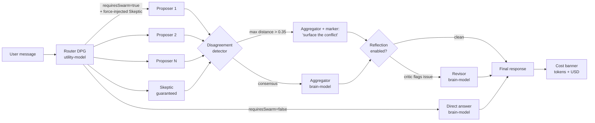

<div align="center">

# Orchestra

[](./LICENSE)
[](https://nextjs.org/)
[](https://www.typescriptlang.org/)
[](#tests)
[](./POST_MORTEMS.md)
[]()

**Local-first AI workspace with a real Mixture-of-Agents pipeline.**

A team of specialized agents, not just one model. Self-hosted, BYOK, MIT-licensed.

[Quick Start](#-quick-start) · [Architecture](#-the-moa-pipeline) · [Features](#-features) · [Docs](#-documentation)

</div>

---

## What makes Orchestra different

Most "self-hosted ChatGPT" projects wrap a single LLM. Orchestra runs **5 specialized expert agents in parallel** on every substantive turn, with a critic that's *guaranteed by code* (not by prompt) to be present in the swarm. The aggregator then synthesizes — and if the experts diverge significantly (measured by embedding distance), the synthesizer is explicitly told to surface the conflict instead of smoothing it away. An optional reflection loop runs a critic over the aggregator's output and applies a revisor pass when issues are flagged.

If that sounds like a paper instead of a feature list — that's intentional. Orchestra is engineering-led: every architectural failure mode is documented in [`POST_MORTEMS.md`](./POST_MORTEMS.md) (40 entries and counting). The aggregator prompt is adapted from the [Together AI MoA reference](https://github.com/togethercomputer/MoA) (validated at 65.1% AlpacaEval, beating GPT-4o on OSS models). The infrastructure layer follows the published research — RadixAttention prefix-cache compatibility, Generator-Critic-Revisor (Reflexion pattern), embedding-based disagreement detection.

You bring your own keys (or run fully local with Ollama). Every chat shows token + USD cost in real time so friends sharing the instance always know what they're spending.

---

## 🎯 The MoA Pipeline

Every Swarm-mode turn flows through this pipeline:



Each stage maps to a [`POST_MORTEMS.md`](./POST_MORTEMS.md) entry that documents *why* it works that way:

| Stage | What | Why it exists |
|---|---|---|
| **Router (DPG)** | Generates 3-5 hyper-specialized personas based on prompt | Static role lists miss domain-specific expertise; dynamic generation tunes per-prompt |
| **Force-injected Skeptic** | Post-validates DPG output, injects Adversarial Critic if missing | PM #37 — prompt-as-contract is unreliable; weak utility-models drop the "MUST include skeptic" instruction silently |
| **Parallel proposers** | 3-5 LLM calls fanned out via `Promise.all` with stagger + per-proposer timeout | Latency cost is parallel, not serial; 1 slow proposer doesn't block the others |
| **Disagreement detector** | Pairwise cosine distance over draft embeddings | PM #39 — academic frameworks call silent smoothing "sycophantic consensus"; threshold 0.35 catches divergent recommendations |
| **Aggregator** | Validated synthesis prompt from togethercomputer/MoA reference | PM #40 — academic literature has a benchmarked prompt; homemade prompts are slope-of-evidence |
| **Reflection critic + revisor** | Generator-Critic-Revisor (Reflexion pattern), opt-in | PM #38 — was dead code before; now wired through with cost attribution |
| **Cost banner** | Per-chat tokens + USD shown in chat header | PM #36 — operator awareness without hard caps; friends sharing the instance see spend |

---

## ⚡ Quick Start

### Local install (recommended for development)

```bash
git clone <repo-url> && cd orchestra
npm install
cp .env.example .env.local       # add at least one provider key
npm run dev
```

Open [http://localhost:3000](http://localhost:3000) → complete onboarding (default credentials are `admin`/`admin`, you'll be required to change them on first login).

### Bring Your Own Key (the only setup step that matters)

```env
# Pick one or more — Orchestra works with the first key it finds:
OPENROUTER_API_KEY=sk-or-...          # recommended: 200+ models via one key
OPENAI_API_KEY=sk-...
ANTHROPIC_API_KEY=sk-ant-...
GOOGLE_API_KEY=...
# Or skip cloud entirely:
# Just install Ollama (https://ollama.com) — Orchestra auto-detects localhost:11434

# Production: set a strong session secret
ORCHESTRA_AUTH_SECRET=$(openssl rand -base64 48)
```

### Full env reference

| Variable | Required | Purpose |
|---|---|---|
| `OPENROUTER_API_KEY` | One of | Recommended provider (cost-flexible) |
| `OPENAI_API_KEY` | One of | OpenAI direct |
| `ANTHROPIC_API_KEY` | One of | Anthropic direct |
| `GOOGLE_API_KEY` | One of | Gemini |
| `ORCHESTRA_AUTH_SECRET` | Production | Session HMAC (`openssl rand -base64 48`) |
| `TAVILY_API_KEY` | No | Tavily web search (optional) |
| `TELEGRAM_BOT_TOKEN` | No | Telegram bot gateway |
| `ORCHESTRA_AUTH_COOKIE_SECURE` | No | Force `Secure` cookie (auto-detect HTTPS otherwise) |
| `ORCHESTRA_LOG_TO_FILE` | No | Write structured JSONL logs to `data/logs/` |
| `ORCHESTRA_DISABLE_AUTH` | Local dev only | Skip auth entirely (`true`) — never enable on a reachable deployment |

---

## ✨ Features

### Core agent runtime
- **Mixture-of-Agents** with dynamic persona generation (3-5 experts per substantive turn)
- **Force-injected Skeptic** — every swarm includes a fact-checker, enforced in code
- **Disagreement detection** — cosine-distance over embeddings; aggregator surfaces conflicts explicitly
- **Reflection loop** (opt-in) — generator-critic-revisor for one extra pass when needed
- **Aggregator prompt** adapted from validated Together MoA reference
- **Swarm Delegation** — orchestrator routes tasks to specialized sub-agents
- **Loop guard** — per-tool fatal-error wrapping so bad tool calls self-heal
- **AbortSignal propagation** through every `generateText` / `generateObject` / `streamText` call

### Cost & transparency
- **Live per-chat cost banner** — tokens + USD estimate, pricing for 7 model families
- **Honest unknown-pricing labels** — when no pricing data, banner says "cost unknown", never fabricates `$0.00`
- **Auto-pilot iteration cap** at 50 — prevents runaway loops

### Workspaces & state
- **Project Workspaces** — isolated per-project memory, skills, MCP servers, file tree
- **Project ZIP Export** — one-click download of entire project as portable archive
- **Memory (RAG)** — vector embeddings over PDF/DOCX/XLSX/Markdown/images
- **Project Blackboard** — cross-agent fact-sharing storage (used by tools)

### Automation
- **Background Auto-Pilot** — daemon iterates on goal trees without UI
- **Cron Scheduler** — RRULE-based recurring agent tasks
- **Skills System** — ~30 bundled, installable from GitHub
- **Telegram Gateway** — full bot mode, group chats, voice notes
- **MCP support** — per-project MCP server config with SSRF guard

### Observability
- **`/api/_debug/chat/<id>`** — single-shot diagnostic endpoint
- **`POST_MORTEMS.md`** — 40 architectural failure modes documented with regression-test pointers
- **Structured JSONL logs** with `traceId` propagation

### Local-first design
- **No external database** — `data/` directory IS the database (atomic writes, file locks)
- **No external cache / queue / broker** — in-process state + SSE bus
- **Ollama out of the box** — auto-detect on `localhost:11434`
- **Single-process invariant** — single Node process, no cluster mode required
- **SIGTERM-flush** — graceful shutdown drains every pending write

---

## 🧪 Tests

```bash
npm test                  # full suite — currently 1930 tests across 134 files
npm run test:coverage     # with v8 coverage
npm run typecheck         # standalone tsc --noEmit
npm run verify            # lint + typecheck + tests + build (pre-deploy gate)
```

Coverage focus:
- **High coverage:** `lib/security/`, `lib/auth/`, `lib/memory/loaders/`, `lib/storage/`, `lib/cost/`, `lib/agent/` (88% lib coverage overall)
- **Lower coverage:** end-to-end agent integration (`agent.ts`, `tool.ts`) — exercised via the live debug endpoint and the cross-concern smoke tests rather than full unit coverage

---

## 🛡 Security model

Orchestra is **designed for a single trusted operator** — your own machine, or a small VPS only you and people you trust have credentials for. The full policy is in [`SECURITY.md`](./SECURITY.md).

Key contracts (all enforced by code, with regression tests):
- **SSRF guard** — `assertSafeOutboundUrl` on every server-side `fetch` from user/model-derived URLs (PM #8, #11, #27)
- **Path traversal guard** — `assertPathInside` on every user-supplied filesystem path (PM #6, #16, #21)
- **`<UNTRUSTED_*>` markers** — every byte from external sources (MCP, web_task) is wrapped before reaching the LLM prompt (PM #26, #27)
- **Process env scrub** — code-execution tool drops `*_KEY`/`*_SECRET`/`*_TOKEN` before `spawn` (PM #28)
- **Login rate-limiter** — sliding-window per-IP, with reverse-proxy configuration documented (PM #13)
- **Session-secret production guard** — refuses to boot with default secret in `NODE_ENV=production` (PM #12)

---

## 📚 Documentation

Start with **[`docs/ARCHITECTURE.md`](./docs/ARCHITECTURE.md)** — guided tour of the system in ~15 minutes.

| Doc | When to read |
|---|---|
| [`docs/ARCHITECTURE.md`](./docs/ARCHITECTURE.md) | First time visitor; want to understand what Orchestra is and how it works |
| [`docs/request-flow.md`](./docs/request-flow.md) | Implementing or debugging a new feature; need to know the request lifecycle |
| [`docs/observability.md`](./docs/observability.md) | Operator / SRE; logging, tracing, on-disk audit trail |
| [`POST_MORTEMS.md`](./POST_MORTEMS.md) | Before refactoring core orchestration logic; every architectural bug we've hit |
| [`CLAUDE.md`](./CLAUDE.md) | Working on the codebase with AI assistance (Claude Code, Cursor, etc.); the rules a code-changing agent should follow |
| [`SECURITY.md`](./SECURITY.md) | Reporting a security issue or deploying beyond `localhost` |
| [`CONTRIBUTING.md`](./CONTRIBUTING.md) | Opening an issue or PR |
| [`NOTICE.md`](./NOTICE.md) | Per-directory licensing for the `bundled-skills/` collection |

---

## 🛣 Roadmap

**v2.0 — Wire what's built** (shipped — PM #36–#40)
- [x] Soft per-chat cost banner with multi-provider pricing
- [x] Force-injected Skeptic in DPG output
- [x] Reflection loop wired (generator-critic-revisor)
- [x] Embedding-based disagreement detection
- [x] Validated togethercomputer/MoA aggregator prompt

**v2.1 — Measurement & quality** (next)
- [ ] Eval harness — assertion-based regression suite for prompt + architecture changes
- [ ] Tools inside proposers (researcher → search_web, coder → code_execution)
- [ ] Live-pricing fetch from OpenRouter `/api/v1/models`

**v3.0 — Local-first power mode**
- [x] SGLang / vLLM backend (PM #43, v0.2.0 — prefix-cache reuse for free 3-6× throughput on consumer GPUs)
- [x] Hardware auto-detect at startup (PM #44 — "I see your RTX 4090, here are 3 recommended MoA configs")
- [x] **Unlimited refinement toggle** (PM #46 — multi-round reflection with cosine-convergence + hard cap)
- [ ] Per-role tier model routing (heterogeneous proposers — different model per persona)
- [ ] Privacy mode badge — hard-disable outbound network during MoA

**v4.0 — Strategic bets**
- [ ] LoRA-swap personas (one base model + persona adapters)
- [ ] Persistent successful-trace memory (DSPy-style bootstrap fewshot)
- [ ] Staircase streaming (NeurIPS 2025 — aggregator starts before proposers finish)
- [ ] Tournament aggregator (Borda count for code/math/factual tasks)

---

## Status

**Alpha quality.** Architecture is end-to-end functional and exercised across 1930 tests. **Not production-grade** for multi-tenant or untrusted-network deployment — see [`POST_MORTEMS.md`](./POST_MORTEMS.md) for known gaps and the trust model in [`SECURITY.md`](./SECURITY.md).

Solo developer project. PRs welcome; review on a best-effort basis.

---

## License

[MIT](./LICENSE) — do whatever you want, just keep the notice.

**Important:** [`bundled-skills/`](./bundled-skills/) contains components under their own licenses (some proprietary, some MIT, some unlicensed). See [`NOTICE.md`](./NOTICE.md) for a per-directory breakdown. The MIT grant on Orchestra does NOT extend to those skills.
