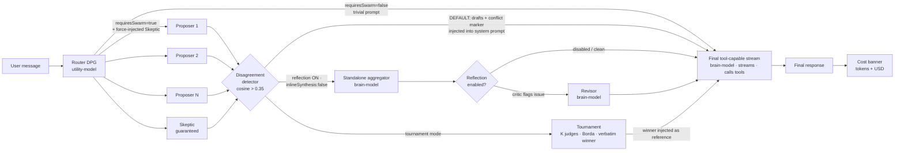

<div align="center">

# Orchestra

[](./LICENSE)
[](https://nextjs.org/)
[](https://www.typescriptlang.org/)
[](https://github.com/aleksbuss/orchestra/actions/workflows/ci.yml)
[](#tests)
[](./POST_MORTEMS.md)
[]()

**Local-first AI workspace with a real Mixture-of-Agents pipeline.**

A team of specialized agents, not just one model. Self-hosted, BYOK, MIT-licensed.


<sub>Every chat shows live token + USD cost (top bar) and the agent fact-checks with web search before answering. Flip on Swarm mode to fan the prompt out to a panel of experts — see [the pipeline below](#-the-moa-pipeline).</sub>

Built on [Eggent](https://github.com/eggent-ai/eggent) (MIT) — a hard fork, substantially extended. See [`NOTICE.md`](./NOTICE.md).

### Orchestra vs Upstream Eggent
| Feature | Upstream Eggent | Orchestra (This repository) |
| --- | --- | --- |
| **Agent Architecture** | Single-agent chat loop | **Mixture-of-Agents (MoA)** ensemble with parallel proposers |
| **Consensus & Verification**| Trust the single model | Code-guaranteed **Skeptic**, Disagreement Detection, Tournament Aggregation |
| **Resilience & Testing** | Basic test suite | **79 Documented Post-Mortems**, a comprehensive unit-test suite, Trace-memory |
| **Cost Transparency** | Unknown API usage | Live per-chat cost banner with USD estimates and tokens |
| **Security** | Basic serverless API | Code-enforced SSRF guards, Path traversal guards, Sandbox constraints |


[Quick Start](#-quick-start) · [Architecture](#-the-moa-pipeline) · [Features](#-features) · [Docs](#-documentation)

</div>

---

## What makes Orchestra different

Most "self-hosted ChatGPT" projects wrap a single LLM. Orchestra runs **5 specialized expert agents in parallel** on every substantive turn, with a critic that's *guaranteed by code* (not by prompt) to be present in the swarm. The synthesis then runs **inline in the final tool-capable stream by default** — the standalone aggregator is collapsed away, so a swarm turn costs **one brain generation, not two**, and the synthesizer can call tools mid-synthesis (set `aggregator.inlineSynthesis: false` to opt back into a standalone aggregator). If the experts diverge significantly (measured by embedding distance), the synthesizer is explicitly told to surface the conflict instead of smoothing it away. An optional reflection loop runs a critic over the synthesis output and applies a revisor pass when issues are flagged (enabling reflection, or setting `inlineSynthesis: false`, falls back to the standalone aggregator; tournament mode swaps synthesis for judge-ranking).

If that sounds like a paper instead of a feature list — that's intentional. Orchestra is engineering-led: every architectural failure mode is documented in [`POST_MORTEMS.md`](./POST_MORTEMS.md) (79 entries and counting). The aggregator prompt is adapted from the [Together AI MoA reference](https://github.com/togethercomputer/MoA) (validated at 65.1% AlpacaEval, beating GPT-4o on OSS models). The infrastructure layer follows the published research — RadixAttention prefix-cache compatibility, Generator-Critic-Revisor (Reflexion pattern), embedding-based disagreement detection.

You bring your own keys (or run fully local with Ollama). Every chat shows token + USD cost in real time so friends sharing the instance always know what they're spending.

**Who it's for:** developers who want a self-hosted assistant that thinks harder than a single model — debugging gnarly systems problems, research that needs fact-checking before it's trusted, or private work on local models where nothing leaves your machine.

---

## 🎯 The MoA Pipeline

Every Swarm-mode turn flows through this pipeline. The key thing to understand: the ensemble's output is **never the terminal answer** — every path converges on **one final tool-capable stream** (the same `streamText` a non-swarm turn uses), which produces the response, streams it, and can call tools. By default the swarm's synthesis happens **inside** that stream (the "inline-synthesis collapse" — one brain generation per turn); the standalone aggregator only runs on the opt-in paths.



> **Inline-synthesis collapse (default since 2c, 2026-06).** On the default synthesis path the swarm does **not** run a separate aggregator generation. `runMoAEnsemble` hands the raw drafts (plus the disagreement marker) up to `runAgent`, which injects them into the **system prompt** of the final tool-capable stream — so that one stream synthesizes the experts inline, **one brain generation per turn instead of two**, and can call tools mid-synthesis. Backed by an N=8 live A/B: quality held, latency −31%, completion tokens −16%. The collapse fires only with **≥2 successful drafts** and `aggregatorMode === "synthesis"`. The **standalone aggregator** (its own brain generation, injected back into the final stream as reference context) runs instead whenever reflection is enabled or `aggregator.inlineSynthesis: false`; **tournament** mode replaces synthesis with judge-ranking. If only 0–1 drafts survive, there is no synthesis at all — the lone draft (or a failure note) is passed straight up and injected as reference. Either way the Router's `requiresSwarm=false` bypass also defers to the same final stream — no proposers, no redundant pre-generation.


<sub>Open the **Swarm Activity** panel (top-right of any chat) to watch the run: the Router auto-generates a panel of experts tuned to the prompt, the Skeptic is always there, and the orchestrator synthesizes the drafts.</sub>

Each stage maps to a [`POST_MORTEMS.md`](./POST_MORTEMS.md) entry that documents *why* it works that way:

| Stage | What | Why it exists |
|---|---|---|
| **Router (DPG)** | Generates 3-5 hyper-specialized personas based on prompt; decides `requiresSwarm` | Static role lists miss domain-specific expertise; dynamic generation tunes per-prompt. Trivial prompts ("thanks", "hi") skip the fan-out — overridable with the **Force Swarm** toggle (PM #22) |
| **Force-injected Skeptic** | Post-validates DPG output, injects Adversarial Critic if missing | PM #37 — prompt-as-contract is unreliable; weak utility-models drop the "MUST include skeptic" instruction silently |
| **Parallel proposers** | 3-5 LLM calls fanned out via `Promise.all` with stagger + per-proposer timeout | Latency cost is parallel, not serial; 1 slow proposer doesn't block the others |
| **Disagreement detector** | Pairwise cosine distance over draft embeddings; emits a "surface the conflict" marker | PM #39 — academic frameworks call silent smoothing "sycophantic consensus"; threshold 0.35 catches divergent recommendations. The marker rides along to whichever synthesis path runs (inline or standalone aggregator) |
| **Synthesis (default: inline)** | Drafts + marker injected into the final stream's system prompt; that stream synthesizes the experts itself | PM #40 synthesis rules ported into the injected directive. Default since Sprint 2c — **one brain generation**, synthesizer can call tools mid-synthesis. Fires only with ≥2 drafts; with 0–1 the lone draft / failure note is passed straight through |
| **Standalone aggregator** | Separate brain generation over the drafts (togethercomputer/MoA reference prompt), injected back as reference context | Runs on the non-inline branch — reflection ON or `inlineSynthesis: false` — the paths the inline collapse deliberately excludes |
| **Tournament** (opt-in) | K judges Borda-rank the drafts; the verbatim winning draft is injected as reference | PM #52 — for "one correct answer" tasks (bug-fix, API design, lookup), picking the best draft beats blending. Skips reflection; not yet collapsed into the stream |
| **Reflection critic + revisor** | Generator-Critic-Revisor (Reflexion pattern), opt-in | PM #38 — was dead code before; now wired through with cost attribution. Inherently multi-pass, so it forces the standalone-aggregator path |
| **Final tool-capable stream** | The single `streamText` that produces, streams, and tool-calls the answer for **every** turn (swarm or not) | The ensemble output is never terminal — convergence here keeps tools, RAG memory, and PM #61 persistence/unwrap on one path |
| **Cost banner** | Per-chat tokens + USD shown in chat header | PM #36 — operator awareness without hard caps; friends sharing the instance see spend |

---

## ⚡ Quick Start

### Local install (recommended for development)

```bash
git clone https://github.com/aleksbuss/orchestra.git && cd orchestra
npm install
cp .env.example .env.local       # add at least one provider key
npm run dev
```

> Prefer a guided setup? `npm run setup:local` (runs `scripts/install-local.sh`) installs dependencies, creates `data/`, and sets up your `.env` (provider keys + session secret). Next.js reads both `.env` and `.env.local`, so either file works.

Open [http://localhost:3000](http://localhost:3000) → complete onboarding (default credentials are `admin`/`admin`, you'll be required to change them on first login).

### Bring Your Own Key (the only setup step that matters)

```env
# Pick one or more — Orchestra works with the first key it finds:
OPENROUTER_API_KEY=sk-or-...          # recommended: 200+ models via one key
OPENAI_API_KEY=sk-...
ANTHROPIC_API_KEY=sk-ant-...
GOOGLE_API_KEY=...
# Or skip cloud entirely:
# Just install Ollama (https://ollama.com) — Orchestra auto-detects localhost:11434

# Production: set a strong session secret
ORCHESTRA_AUTH_SECRET=$(openssl rand -base64 48)
```

### Full env reference

| Variable | Required | Purpose |
|---|---|---|
| `OPENROUTER_API_KEY` | One of | Recommended provider (cost-flexible) |
| `OPENAI_API_KEY` | One of | OpenAI direct |
| `ANTHROPIC_API_KEY` | One of | Anthropic direct |
| `GOOGLE_API_KEY` | One of | Gemini |
| `ORCHESTRA_AUTH_SECRET` | Production | Session HMAC (`openssl rand -base64 48`) |
| `TAVILY_API_KEY` | No | Tavily web search (optional) |
| `TELEGRAM_BOT_TOKEN` | No | Telegram bot gateway |
| `ORCHESTRA_AUTH_COOKIE_SECURE` | No | Force `Secure` cookie (auto-detect HTTPS otherwise) |
| `ORCHESTRA_LOG_TO_FILE` | No | Write structured JSONL logs to `data/logs/` |
| `ORCHESTRA_DATA_DIR` | No | Override the data root (default `<cwd>/data`). Point at a throwaway dir to isolate tests/dev runs without touching real data. |
| `ORCHESTRA_DISABLE_AUTH` | Local dev only | Skip auth entirely (`true`) — never enable on a reachable deployment |

---

## ✨ Features

### Core agent runtime
- **Mixture-of-Agents** with dynamic persona generation (3-5 experts per substantive turn)
- **Force-injected Skeptic** — every swarm includes a fact-checker, enforced in code
- **Disagreement detection** — cosine-distance over embeddings; the synthesizer surfaces conflicts explicitly
- **Inline-synthesis collapse** — the final tool-capable stream synthesizes the drafts itself (one brain generation per turn) and can call tools mid-synthesis
- **Reflection loop** (opt-in) — generator-critic-revisor for one extra pass when needed
- **Aggregator prompt** adapted from validated Together MoA reference (standalone-aggregator paths)
- **Swarm Delegation** — orchestrator routes tasks to specialized sub-agents
- **Loop guard** — per-tool fatal-error wrapping so bad tool calls self-heal
- **AbortSignal propagation** through every `generateText` / `generateObject` / `streamText` call

### Cost & transparency
- **Live per-chat cost banner** — tokens + USD estimate, pricing for 7 model families
- **Honest unknown-pricing labels** — when no pricing data, banner says "cost unknown", never fabricates `$0.00`
- **Auto-pilot iteration cap** at 50 — prevents runaway loops

### Workspaces & state
- **Project Workspaces** — isolated per-project memory, skills, MCP servers, file tree
- **Project ZIP Export** — one-click download of entire project as portable archive
- **Memory (RAG)** — vector embeddings over PDF/DOCX/XLSX/Markdown/images
- **Project Blackboard** — cross-agent fact-sharing storage (used by tools)

### Automation
- **Background Auto-Pilot** — daemon iterates on goal trees without UI
- **Cron Scheduler** — RRULE-based recurring agent tasks
- **Skills System** — ~30 bundled, installable from GitHub
- **Telegram Gateway** — full bot mode, group chats, voice notes
- **MCP support** — per-project MCP server config with SSRF guard

### Observability
- **`/api/_debug/chat/<id>`** — single-shot diagnostic endpoint
- **`POST_MORTEMS.md`** — 70 architectural failure modes documented with regression-test pointers
- **Structured JSONL logs** with `traceId` propagation

### Local-first design
- **No external database** — `data/` directory IS the database (atomic writes, file locks)
- **No external cache / queue / broker** — in-process state + SSE bus
- **Ollama out of the box** — auto-detect on `localhost:11434`
- **Single-process invariant** — single Node process, no cluster mode required
- **SIGTERM-flush** — graceful shutdown drains every pending write

---

## 🧪 Tests

```bash
npm test                  # full unit-test suite (live count in the tests badge above)
npm run test:coverage     # with v8 coverage
npm run typecheck         # standalone tsc --noEmit
npm run verify            # lint + typecheck + tests + build (pre-deploy gate)
```

Coverage focus (measured via v8, `src/lib` aggregate ≈61% lines, global ≈46%):
- **High (>90% lines):** `lib/security/` (99%), `lib/memory/` (97%), `lib/cost/` (97%), `lib/auth/` (91%)
- **Mid:** `lib/storage/` (~78%), `lib/cron/` (~69%), `lib/agent/` (~63%)
- **Lower:** `lib/tools/` (~40%; the large `tool.ts` registry is ~24%), `lib/providers/` (~43%), `lib/mcp/` (~8%), and most of `components/` — exercised via smoke / integration / the live debug endpoint rather than full unit coverage. Per-module floors in `vitest.config.ts` gate the high-blast-radius files (auth, security, the path sandbox) at 60–90%.

---

## 🛡 Security model

Orchestra is **designed for a single trusted operator** — your own machine, or a small VPS only you and people you trust have credentials for. The full policy is in [`SECURITY.md`](./SECURITY.md).

Key contracts (all enforced by code, with regression tests):
- **SSRF guard** — `assertSafeOutboundUrl` on every server-side `fetch` from user/model-derived URLs (PM #8, #11, #27)
- **Path traversal guard** — `assertPathInside` on every user-supplied filesystem path (PM #6, #16, #21)
- **`<UNTRUSTED_*>` markers** — every byte from external sources (MCP, web_task) is wrapped before reaching the LLM prompt (PM #26, #27)
- **Process env scrub** — every agent-spawned child process (code-execution, `install_packages`, the codex/gemini CLIs) builds its env via `scrubProcessEnv` / `cliProviderEnv`, dropping `*_KEY`/`*_SECRET`/`*_TOKEN` + the app auth secret before `spawn` (PM #28, #70)
- **Login rate-limiter** — sliding-window per-IP, with reverse-proxy configuration documented (PM #13)
- **Session-secret production guard** — refuses to boot with default secret in `NODE_ENV=production` (PM #12)

---

## 📚 Documentation

Start with **[`docs/ARCHITECTURE.md`](./docs/ARCHITECTURE.md)** — guided tour of the system in ~15 minutes.

| Doc | When to read |
|---|---|
| [`docs/ARCHITECTURE.md`](./docs/ARCHITECTURE.md) | First time visitor; want to understand what Orchestra is and how it works |
| [`docs/request-flow.md`](./docs/request-flow.md) | Implementing or debugging a new feature; need to know the request lifecycle |
| [`docs/observability.md`](./docs/observability.md) | Operator / SRE; logging, tracing, on-disk audit trail |
| [`POST_MORTEMS.md`](./POST_MORTEMS.md) | Before refactoring core orchestration logic; every architectural bug we've hit |
| [`CLAUDE.md`](./CLAUDE.md) | Working on the codebase with AI assistance (Claude Code, Cursor, etc.); the rules a code-changing agent should follow |
| [`SECURITY.md`](./SECURITY.md) | Reporting a security issue or deploying beyond `localhost` |
| [`CONTRIBUTING.md`](./CONTRIBUTING.md) | Opening an issue or PR |
| [`NOTICE.md`](./NOTICE.md) | Per-directory licensing for the `bundled-skills/` collection |

---

## 🧰 Configuration recipes

The v3 and v4 features in this README are all opt-in via `data/settings/settings.json`. The UI for them lives in v3.1; until then, the recipes below are the canonical way to turn them on.

### Cost-optimized MoA (heterogeneous tiers — PM #48)

Skeptic personas run on a cheap fast tier, coder personas on a frontier tier. On reference workloads this is ~60% cheaper than uniform-frontier with no measured quality loss.

```json
{
  "proposerTiers": {
    "fast": {
      "provider": "anthropic",
      "model": "claude-haiku-4-5-20251001",
      "apiKey": ""
    },
    "balanced": {
      "provider": "anthropic",
      "model": "claude-sonnet-4-6",
      "apiKey": ""
    },
    "frontier": {
      "provider": "anthropic",
      "model": "claude-opus-4-7",
      "apiKey": ""
    }
  }
}
```

Empty `apiKey` inherits the key from `chatModel` (same provider). Mix providers freely — fast on Anthropic, frontier on a local Qwen — Orchestra honors heterogeneous tiers.

### Air-gapped mode (PM #47)

```json
{
  "privacyMode": { "enabled": true },
  "chatModel": {
    "provider": "ollama",
    "model": "qwen2.5:7b",
    "baseUrl": "http://localhost:11434"
  },
  "utilityModel": {
    "provider": "ollama",
    "model": "qwen2.5:3b",
    "baseUrl": "http://localhost:11434"
  },
  "embeddingsModel": {
    "provider": "ollama",
    "model": "nomic-embed-text"
  }
}
```

`runAgent` refuses the run if ANY of chatModel / utilityModel / embeddingsModel / proposerTiers resolves to a non-local backend. The chat UI surfaces a 🔒 badge whenever Privacy Mode is active.

### Tournament aggregator for code/math/factual chats (PM #52)

The synthesis aggregator (default) is great for open-ended writing. For chats focused on getting **one correct answer** (bug-fixing, API design, factual lookup), tournament mode picks the best proposer draft verbatim via Borda count over K judges.

```json
{
  "aggregator": {
    "mode": "tournament",
    "tournamentJudgeCount": 3,
    "tournamentJudgeModel": {
      "provider": "anthropic",
      "model": "claude-haiku-4-5-20251001"
    }
  }
}
```

K=1 is the cheapest (single judge picks best draft, no consensus). K=3 gives true Borda consensus and smooths individual-judge bias. Set `tournamentJudgeModel` to a fast-tier model to keep K=3 affordable.

> **Privacy Mode note (PM #54).** `tournamentJudgeModel` is now subject to the same air-gap check as `chatModel`/`utilityModel`/`embeddingsModel`/`proposerTiers` — if you have `privacyMode.enabled = true`, the judge model MUST resolve to a local backend (ollama/sglang/vllm/loopback-custom). `runAgent` refuses the call with a clear error otherwise.

### Self-verifying coder proposers (PM #50)

Lets coder-tagged proposers run Python/Node snippets to validate library APIs, output shape, and regex behavior before drafting. Default off because each proposer × child process is a heavier failure surface than `search_web`.

```json
{
  "codeExecution": {
    "enabled": true,
    "timeout": 600,
    "maxOutputLength": 120000,
    "proposerAccess": true
  }
}
```

The orchestrator already had `code_execution`; this extends it to MoA proposers. Concurrency naturally capped by the agent semaphore (2 permits across proposer turns; each proposer can still make multiple sequential `code_execution` calls within its own turn).

> **Risky combo with tournament mode (PM #54).** If you also set `aggregator.mode = "tournament"`, ALL coder proposers run code in the same project cwd but only the WINNING draft's text is shown. Losing proposers' side effects (files written, packages installed) PERSIST in the project. Per-proposer sandboxing is tracked as future work. For now, prefer synthesis mode when `proposerAccess` is on, or accept the trade-off and audit the cwd after big chats.

### Trace memory — DSPy-style fewshots from your own runs (PM #51)

Captures successful MoA runs and injects the top-K most similar past traces as Router few-shots. Quality-gated by signals from the run itself (proposer consensus, clean critic, no reflection cap).

```json
{
  "traceMemory": {
    "enabled": true,
    "qualityThreshold": 0.7,
    "retrievalK": 3
  }
}
```

Inspect / curate the pool from the command line:

```bash
npm run trace:list                          # global pool (default)
npm run trace:list -- --all                 # global + every project's pool
npm run trace:list -- --project <id>        # one project's pool
npm run trace:show -- <id>                  # full trace (across scopes if needed)
npm run trace:stats -- --project <id>       # pool size, score distribution
npm run trace:delete -- <id> --project <id> # remove one trace from a project's pool
npm run trace:clear -- --project <id>       # wipe one pool (typed confirmation)
```

Trace pools are scoped (PM #55) — captures from project-owned chats land under `data/projects/<id>/.orchestra_traces/` and retrieval for that project ONLY reads from its own pool, so unrelated projects don't poison each other's Router prompt. Global chats (no projectId) use `data/traces/`. Operator-controlled retention.

### Multi-round reflection (PM #46)

Loop the critic-reviser until the answer converges or hits a hard cap. Default cap is 1 (single pass — PM #38). Set higher when running local models where the per-iteration cost is electricity.

```json
{
  "reflection": {
    "enabled": true,
    "maxRounds": 5,
    "convergenceThreshold": 0.97
  }
}
```

The code-level hard cap (`ABSOLUTE_MAX_REFLECTION_ROUNDS = 50`) overrides any operator value — protects against config typos.

### Diagnostics

```bash
curl http://localhost:3000/api/health | jq    # subsystem report incl. tier/trace/aggregator state
npm run trace:stats                            # trace pool health
npm run evals -- --case "<name>"               # behavioral regression sanity
```

The `/api/health` endpoint now surfaces aggregator mode, trace-memory pool size, and OpenRouter pricing-cache age (PM #53) — useful for operator-driven checks without grepping `data/`.

---

## 🛣 Roadmap

**v2.0 — Wire what's built** (shipped — PM #36–#40)
- [x] Soft per-chat cost banner with multi-provider pricing
- [x] Force-injected Skeptic in DPG output
- [x] Reflection loop wired (generator-critic-revisor)
- [x] Embedding-based disagreement detection
- [x] Validated togethercomputer/MoA aggregator prompt

**v2.1 — Measurement & quality** (shipped)
- [x] Eval harness — assertion-based regression suite (PM #41, 10 cases + 31 test pinning)
- [x] Tools inside proposers — `search_web` for reviewer + researcher with Fact-Check Mandate (PM #42); `code_execution` for coder with Code-Exec Mandate, opt-in via `proposerAccess` (PM #50)
- [x] **Live-pricing fetch from OpenRouter** `/api/v1/models` (PM #49 — 24h cache, disk-warm, Privacy-Mode-aware)

**v3.0 — Local-first power mode**
- [x] SGLang / vLLM backend (PM #43, v0.2.0 — prefix-cache reuse for free 3-6× throughput on consumer GPUs)
- [x] Hardware auto-detect at startup (PM #44 — "I see your RTX 4090, here are 3 recommended MoA configs")
- [x] **Unlimited refinement toggle** (PM #46 — multi-round reflection with cosine-convergence + hard cap)
- [x] **Privacy mode** (PM #47 — runAgent refuses non-local providers when `privacyMode.enabled`; UI badge)
- [x] **Per-role tier model routing** (PM #48 — Skeptic → fast, Coder → frontier; Anthropic's Opus/Sonnet pattern; cost-shape win)

**v4.0 — Strategic bets**
- [ ] LoRA-swap personas (one base model + persona adapters)
- [x] **Persistent successful-trace memory** (PM #51 — DSPy-style bootstrap fewshot; quality-gated capture + cosine retrieval; Privacy-Mode-safe)
- [ ] Staircase streaming (NeurIPS 2025 — aggregator starts before proposers finish)
- [x] **Tournament aggregator** (PM #52 — Borda count over K judges; K=1 cheap "judge picks best", K=3 consensus; falls back to synthesis on failure; trace-memory & Privacy-Mode compatible)

---

## Status

**Alpha quality.** Architecture is end-to-end functional and exercised across a comprehensive automated test suite. **Not production-grade** for multi-tenant or untrusted-network deployment — see [`POST_MORTEMS.md`](./POST_MORTEMS.md) for known gaps and the trust model in [`SECURITY.md`](./SECURITY.md).

Solo developer project. PRs welcome; review on a best-effort basis.

---

## License

[MIT](./LICENSE) — do whatever you want, just keep the notice.

**Important:** [`bundled-skills/`](./bundled-skills/) contains components under their own licenses (some proprietary, some MIT, some unlicensed). See [`NOTICE.md`](./NOTICE.md) for a per-directory breakdown. The MIT grant on Orchestra does NOT extend to those skills.
