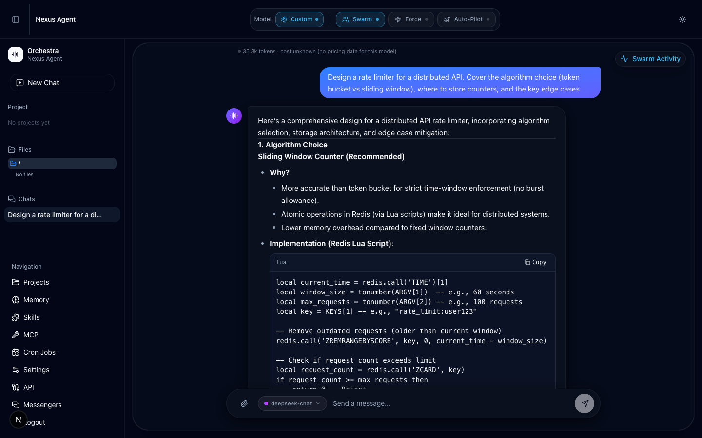
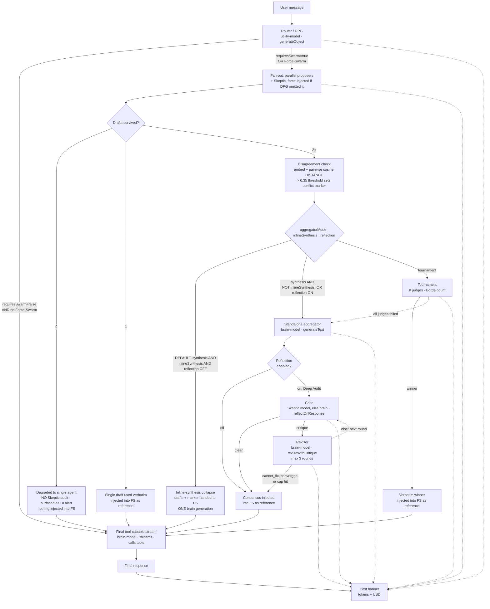
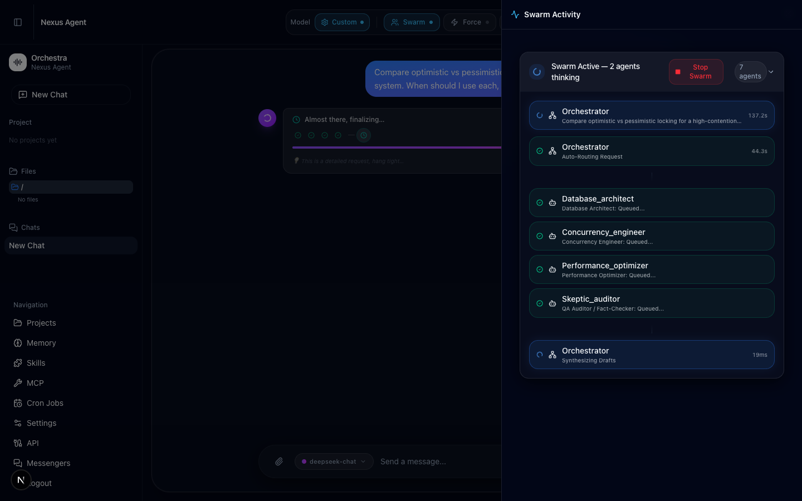

<div align="center">

# Orchestra

**Local-first AI workspace with a real Mixture-of-Agents pipeline.**

Built, measured, and honest about where it helps. Self-hosted, BYOK, MIT-licensed.

[](./LICENSE)
[](https://nextjs.org/)
[](https://www.typescriptlang.org/)
[](https://github.com/aleksbuss/orchestra/actions/workflows/ci.yml)
[](#tests)
[](./POST_MORTEMS.md)
[](#status)



<sub>Every chat shows live token + USD cost (top bar) and the agent fact-checks with web search before answering. Flip on Swarm mode to fan the prompt out to a panel of experts — see [the pipeline below](#how-it-works).</sub>

[Quick Start](#quick-start) · [Features](#features) · [How it works](#how-it-works) · [Evidence](#evidence) · [Configuration](#configuration) · [Docs](#documentation)

</div>

## What is Orchestra

Orchestra is a self-hosted AI workspace. On every substantive turn a **Router** decides whether the question deserves a panel. If it does, 3–5 specialist agents draft answers in parallel and a **Skeptic** — guaranteed by code, not by prompt — audits them. The final answer is synthesized from the drafts, and if the experts diverge (measured by embedding distance) the answer says so instead of smoothing it over.

- **Your keys, or none.** Bring your own provider keys (OpenRouter, OpenAI, Anthropic, Google) or run fully local on Ollama; Privacy Mode refuses any run that would touch a non-local model.
- **Live cost.** Every chat shows tokens and a USD estimate in real time, so anyone sharing the instance sees what they spend.
- **Engineering-led.** Every architectural failure mode is documented in [`POST_MORTEMS.md`](./POST_MORTEMS.md) — root cause, resolution, and a pointer to the regression test that keeps it fixed.

**Who it's for:** developers who want a self-hosted assistant with a panel of experts and a code-guaranteed critic behind it — debugging gnarly systems problems, research that needs fact-checking before it's trusted, or private work on local models where nothing leaves your machine.

## Quick Start

**Requirements:** [Node.js](https://nodejs.org/) 22+ and npm 10+ (pinned in [`.nvmrc`](./.nvmrc)), `git`, `python3` and `curl` — or just Docker with Compose v2.

### Option 1 — Local install

```bash
git clone https://github.com/aleksbuss/orchestra.git
cd orchestra
npm run setup:local   # installs deps, generates secrets into .env, builds, smoke-tests
npm run start         # → http://localhost:3000
```

`setup:local` is a **production** setup: it creates `.env` from [`.env.example`](./.env.example) with generated secrets, runs `npm install` and `npm run build`, then smoke-tests `/api/health`. It does not ask for a model key — add one in [the step below](#add-a-model-key). The server listens on `127.0.0.1` only; to expose it (LAN, VPS) set `ORCHESTRA_BIND_HOST=0.0.0.0` in the process environment — the shell reads it before Next loads `.env`, so it has no effect from `.env` — and read [`SECURITY.md`](./SECURITY.md) first.

Hacking on the code instead? Skip the installer and run the dev server (Next.js reads both `.env` and `.env.local`, so either file works):

```bash
git clone https://github.com/aleksbuss/orchestra.git
cd orchestra
npm install
cp .env.example .env.local   # then add at least one provider key
npm run dev                  # → http://localhost:3000
```

### Option 2 — Docker

Runs Orchestra, and any code the agent executes, inside a container; only `./data` is mounted from your machine.

```bash
git clone https://github.com/aleksbuss/orchestra.git
cd orchestra
bash scripts/install-docker.sh   # same as `npm run setup:docker`; builds the image and starts it
```

The container listens on `127.0.0.1:3000` by default; change `APP_BIND_HOST` / `APP_PORT` in `.env` to expose it differently.

### First run

Open <http://localhost:3000> and sign in with `admin` / `admin`. Orchestra makes you change these credentials straight away.

### Add a model key

You need **one** provider key. Paste it into the **API Keys Vault** in Settings, or put it in your env file — `.env`, or `.env.local` for the dev server (with Docker, apply an edit with `docker compose up -d --force-recreate app`):

```env
# Pick one or more — Orchestra works with the first key it finds:
OPENROUTER_API_KEY=sk-or-...          # recommended: hundreds of models via one key
OPENAI_API_KEY=sk-...
ANTHROPIC_API_KEY=sk-ant-...
GOOGLE_API_KEY=...
```

In `.env.example` these lines are commented out on purpose: any non-empty value counts as a real key, so uncomment only the provider you actually hold a key for.

No cloud account at all? Install [Ollama](https://ollama.com) — Orchestra auto-detects it on `localhost:11434`. No budget? Turn on [Free Mode](#free-mode).

**"The first key it finds" is literal.** On a fresh install the chat and utility model slots are pointed at whichever provider you actually have a credential for — checked in the API Keys Vault first, then the env vars above, in the order OpenRouter → Anthropic → Google. Nothing to configure. Two things this deliberately does *not* do: it never overrides a model you picked yourself (Settings wins, always), and it leaves embeddings on OpenAI, because OpenRouter has no embeddings API — semantic memory needs an OpenAI key or a local Ollama embedding model. See PM #101.

**Deploying beyond localhost?** The installers generate `ORCHESTRA_AUTH_SECRET` for you. If you set it by hand, generate the value first and paste the *output* — `.env` files do not run shell commands, so `ORCHESTRA_AUTH_SECRET=$(openssl rand -base64 48)` would store that literal text as your secret.

```bash
openssl rand -base64 48
```

In production Orchestra refuses to start with a missing or known-insecure secret. Read [`SECURITY.md`](./SECURITY.md) before exposing an instance; every variable is listed under [Configuration](#environment-variables).

## Features

### Core agent runtime
- **Mixture-of-Agents** with dynamic persona generation (3-5 experts per substantive turn)
- **Force-injected Skeptic** — every swarm includes a fact-checker, enforced in code (injected unconditionally — PM #91)
- **Operator-owned Skeptic** — the Skeptic/critic model (swarm reviewer *and* reflection critic) is pinned by the operator, with a Privacy-Mode-guarded **per-request override** to swap it for a single turn (PM #90)
- **Per-request Deep Audit** — enable the reflection critic for one turn without paying its latency on every swarm turn
- **Degraded-swarm surfacing** — if every proposer fails, the turn collapses to a single agent and says so (never a silent downgrade)
- **Disagreement detection** — cosine-distance over embeddings; the synthesizer surfaces conflicts explicitly
- **Inline-synthesis collapse** — the final tool-capable stream synthesizes the drafts itself (one brain generation per turn) and can call tools mid-synthesis
- **Reflection loop** (opt-in) — generator-critic-revisor for one extra pass when needed
- **Aggregator prompt** adapted from validated Together MoA reference (standalone-aggregator paths)
- **Swarm Delegation** — orchestrator routes tasks to specialized sub-agents
- **Loop guard** — per-tool fatal-error wrapping so bad tool calls self-heal
- **AbortSignal propagation** through every `generateText` / `generateObject` / `streamText` call

### Cost & transparency
- **Live per-chat cost banner** — tokens + USD estimate, priced from OpenRouter's live catalogue (24 h cache) and a built-in table for direct provider keys
- **Honest unknown-pricing labels** — when no pricing data, banner says "cost unknown", never fabricates `$0.00`
- **Auto-pilot iteration cap** at 50 — prevents runaway loops

### Workspaces & state
- **Project Workspaces** — isolated per-project memory, skills, MCP servers, file tree
- **Project ZIP Export** — one-click download of entire project as portable archive
- **Memory (RAG)** — vector embeddings over PDF/DOCX/XLSX/Markdown/images
- **Project Blackboard** — cross-agent fact-sharing storage (used by tools)

### Automation
- **Background Auto-Pilot** — daemon iterates on goal trees without UI
- **Cron Scheduler** — cron expressions (with timezone), fixed intervals and one-shot runs
- **Skills System** — bundled and installable from GitHub; bundled skills keep their own licenses (see [License](#license))
- **Telegram Gateway** — full bot mode, group chats, voice notes
- **MCP support** — per-project MCP server config with SSRF guard

### Observability
- **`/api/debug/chat/<id>`** — single-shot diagnostic endpoint
- **`POST_MORTEMS.md`** — architectural failure modes documented with regression-test pointers
- **Structured JSONL logs** with `traceId` propagation

### Local-first design
- **No external database** — `data/` directory IS the database (atomic writes, file locks)
- **No external cache / queue / broker** — in-process state + SSE bus
- **Ollama out of the box** — auto-detect on `localhost:11434`
- **SGLang and vLLM backends** — prefix-cache-friendly serving for your own GPU (PM #43)
- **Hardware auto-detect** — probes your OS, RAM and GPU and suggests MoA configurations that fit them (PM #44)
- **Single-process invariant** — single Node process, no cluster mode required
- **SIGTERM-flush** — graceful shutdown drains every pending write

## How it works

Every Swarm-mode turn flows through this pipeline. The key thing to understand: the ensemble's output is **never the terminal answer** — every path converges on **one final tool-capable stream** (the same `streamText` a non-swarm turn uses), which produces the response, streams it, and can call tools. By default the swarm's synthesis happens **inside** that stream (the "inline-synthesis collapse" — one brain generation per turn); the standalone aggregator only runs on the opt-in paths.


```mermaid
flowchart TD
    U[User message] --> R[Router / DPG<br/>utility-model · generateObject]
    R -->|requiresSwarm=false<br/>AND no Force-Swarm| FS[Final tool-capable stream<br/>brain-model · streams · calls tools]
    R -->|requiresSwarm=true<br/>OR Force-Swarm| FAN[Fan-out: parallel proposers<br/>+ Skeptic, force-injected if DPG omitted it]

    FAN --> SURV{Drafts survived?}
    SURV -->|0| DEG[Degraded to single agent<br/>NO Skeptic audit · surfaced as UI alert<br/>nothing injected into FS]
    SURV -->|1| S1[Single draft used verbatim<br/>injected into FS as reference]
    SURV -->|2+| DD[Disagreement check<br/>embed + pairwise cosine DISTANCE<br/>&gt; 0.35 threshold sets conflict marker]

    DEG --> FS
    S1 --> FS

    DD --> GATE{aggregatorMode ·<br/>inlineSynthesis · reflection}
    GATE -->|DEFAULT: synthesis AND<br/>inlineSynthesis AND reflection OFF| INL[Inline-synthesis collapse<br/>drafts + marker handed to FS<br/>ONE brain generation]
    GATE -->|synthesis AND<br/>NOT inlineSynthesis, OR reflection ON| AGG[Standalone aggregator<br/>brain-model · generateText]
    GATE -->|tournament| TQ[Tournament<br/>K judges · Borda count]

    INL --> FS
    TQ -->|winner| TW[Verbatim winner<br/>injected into FS as reference]
    TW --> FS
    TQ -.->|all judges failed| AGG

    AGG --> RGATE{Reflection<br/>enabled?}
    RGATE -->|off| REFOUT[Consensus injected<br/>into FS as reference]
    RGATE -->|on, Deep Audit| CRIT[Critic<br/>Skeptic model, else brain · reflectOnResponse]
    CRIT -->|clean| REFOUT
    CRIT -->|critique| REV[Revisor<br/>brain-model · reviseWithCritique<br/>max 3 rounds]
    REV -->|cannot_fix, converged,<br/>or cap hit| REFOUT
    REV -.->|else: next round| CRIT
    REFOUT --> FS

    FS --> OUT[Final response]
    OUT --> CB[Cost banner<br/>tokens + USD]
    R -.-> CB
    FAN -.-> CB
    AGG -.-> CB
    TQ -.-> CB
    CRIT -.-> CB
    REV -.-> CB
```

> **Inline-synthesis collapse (default since 2c, 2026-06).** With ≥2 successful drafts the swarm does **not** run a separate aggregator generation: `runMoAEnsemble` hands the raw drafts (plus the disagreement marker) up to `runAgent`, which injects them into the **system prompt** of the final tool-capable stream. That one stream synthesizes the experts inline — **one brain generation per turn instead of two** — and can call tools mid-synthesis. Backed by an N=8 live A/B: quality held, latency −31%, completion tokens −16%. The standalone aggregator, tournament mode, the one-draft pass-through and the zero-draft degradation (surfaced to the operator, never silent) are covered in the stage table below. The Router's `requiresSwarm=false` bypass defers to the same final stream — no proposers, no redundant pre-generation.



<sub>Open the **Swarm Activity** panel (top-right of any chat) to watch the run: the Router auto-generates a panel of experts tuned to the prompt, the Skeptic is always there, and the orchestrator synthesizes the drafts.</sub>

Each stage maps to a [`POST_MORTEMS.md`](./POST_MORTEMS.md) entry that documents *why* it works that way:

| Stage | What | Why it exists |
|---|---|---|
| **Router (DPG)** | Generates 3-5 hyper-specialized personas based on prompt; decides `requiresSwarm` | Static role lists miss domain-specific expertise; dynamic generation tunes per-prompt. Trivial prompts ("thanks", "hi") skip the fan-out — overridable with the **Force Swarm** toggle (PM #22) |
| **Force-injected Skeptic** | Post-validates DPG output, injects the Adversarial Critic if missing — **unconditionally** (even on a "trivial" verdict, so a Force-Swarm-over-bypass turn still gets it). The Skeptic **model** is operator-pinnable, with a per-request override | PM #37 (prompt-as-contract is unreliable) + PM #90/#91 (guarantee the persona wherever the swarm can fan out; let the operator own the critic model) |
| **Parallel proposers** | 3-5 LLM calls fanned out via `Promise.all` with stagger + per-proposer timeout | Latency cost is parallel, not serial; 1 slow proposer doesn't block the others |
| **Disagreement detector** | Pairwise cosine distance over draft embeddings; emits a "surface the conflict" marker | PM #39 — academic frameworks call silent smoothing "sycophantic consensus"; threshold 0.35 catches divergent recommendations. The marker rides along to whichever synthesis path runs (inline or standalone aggregator) |
| **Synthesis (default: inline)** | Drafts + marker injected into the final stream's system prompt; that stream synthesizes the experts itself | PM #40 synthesis rules ported into the injected directive. Default since Sprint 2c — **one brain generation**, synthesizer can call tools mid-synthesis. Fires only with ≥2 drafts. With exactly 1, that draft passes through verbatim as reference (unreviewed). With 0, nothing passes through — the swarm degrades to a single agent instead |
| **Standalone aggregator** | Separate brain generation over the drafts (togethercomputer/MoA reference prompt), injected back as reference context | Runs on the non-inline branch — reflection ON or `inlineSynthesis: false` — the paths the inline collapse deliberately excludes |
| **Tournament** (opt-in) | K judges Borda-rank the drafts; the verbatim winning draft is injected as reference | PM #52 — for "one correct answer" tasks (bug-fix, API design, lookup), picking the best draft beats blending. Skips reflection; falls back to the standalone aggregator if every judge fails; not yet collapsed into the stream |
| **Reflection critic + revisor** | Generator-Critic-Revisor (Reflexion pattern), opt-in | PM #38 — was dead code before; now wired through with cost attribution. Inherently multi-pass, so it forces the standalone-aggregator path |
| **Final tool-capable stream** | The single `streamText` that produces, streams, and tool-calls the answer for **every** turn (swarm or not) | The ensemble output is never terminal — convergence here keeps tools, RAG memory, and PM #61 persistence/unwrap on one path |
| **Cost banner** | Per-chat tokens + USD shown in chat header | PM #36 — operator awareness without hard caps; friends sharing the instance see spend |

**Design lineage.** The aggregator prompt is adapted from the [Together AI MoA reference](https://github.com/togethercomputer/MoA) (Apache-2.0; see [Credits](#credits)). The infrastructure layer follows the published research — RadixAttention prefix-cache compatibility, Generator-Critic-Revisor (the Reflexion pattern), and embedding-based disagreement detection.

## Evidence

The pipeline above is the design. These two sections are the evidence for it, reported the way I would want to read someone else's.

### What the ensemble actually measures — including the result I didn't want

I pre-registered a five-arm evaluation of the swarm against a single agent — same model everywhere, kill criterion written and committed **before any arm ran**: *if the best swarm arm does not beat the single-agent control by ≥ +0.05 mean score, the MoA feature does not earn its place.* Full protocol and results: [`docs/moa-selection-vs-averaging.md`](./docs/moa-selection-vs-averaging.md).

**The factorial never ran.** I could not construct a task where the single agent had room to improve. On logic-grid puzzles generated from a seeded RNG and brute-forced to a unique solution — problems no model can have memorised — one *free* model scored 36/36. Across five independently built task classes the control sat at 0.96–1.00.

So the measured difference is **0.0000**, and that number means the instrument was saturated, not that the ensemble lost. A contrast against a control at 1.0 is mechanically bounded at ≤ 0 before any arm runs. Nothing was demonstrated about the ensemble's answer quality in either direction.

What this does and does not license:

- **Tested:** short-form verifiable tasks — constrained code authoring, fact traps, sycophancy pressure, multi-claim auditing, novel deductive puzzles. On these, the model is not the bottleneck, and the swarm costs **4.4× wall clock** and 4.5× completion tokens for no measurable gain. Swarm mode still ships **on**, with the Router deciding per turn whether a prompt is worth fanning out at all — but on this evidence, turning it off for short verifiable work costs you nothing and saves the 4.4×.
- **Not tested:** long-horizon agentic work — multi-file edits, long tool loops, many turns where errors compound. That is the only regime where an ensemble still has a plausible case, and it needs a harness that verifies a repo end-state. That harness does not exist yet.
- **One clearly positive result:** across 24 swarm runs — three free proposers fanned out at one shared free endpoint, the exact herd that triggers upstream 429s — there were **zero delivery failures and zero silent collapses to single-agent**. Twenty-four runs is a pilot, not an uptime claim, and what it measures is robustness to upstream throttling specifically — but that is the one thing here that held under a deliberate stress.

If you are here to evaluate the engineering rather than the marketing, that document and [`POST_MORTEMS.md`](./POST_MORTEMS.md) are the two files to read.

### How the defects that mattered were actually found

The badges above count the tests and the post-mortems. Here is the uncomfortable part: **the tests did not find the serious ones.**

Below are the ten most instructive entries — chosen as the highest-severity ones plus every case whose *discovery method* taught something. **Exactly one was surfaced by a failing assertion**, and even that one is a scan CI skips. The rest came from running the thing, reading the code, or asking what nothing covered. (#100 was noticed *during* a test run, but by watching directory timestamps move — no assertion failed.)

| # | What was wrong | How it actually surfaced | What stops a repeat |
|---|---|---|---|
| **99** | `P0` A key saved in the API Keys Vault never reached the agent. Every fresh install was 100% dead. | A cold install on a second machine. **Unreproducible on a dev box** — `.env.local` silently covers for the broken vault lookup. | [`key-resolution-contract.test.ts`](src/lib/agent/key-resolution-contract.test.ts) — no `createModel(settings.<slot>)` anywhere |
| **92** | `P1`, latent `P0` Untrusted Telegram triggers inherited RCE-class tools: prompt injection → code execution on the operator's machine. | Architecture review plus a cross-model second opinion on the trust boundary; confirmed by grep. | [`untrusted-trigger-contract.test.ts`](src/lib/agent/untrusted-trigger-contract.test.ts) — the flag is forwarded at every delegation hop |
| **98** | `P1` Free Mode picked a tool-incapable model and the stream had no time bound. A simple question hung for seven minutes: no answer, no error. | Live, by the operator. The free-tier measurement that "passed" had exercised a different code path. | [`call-deadline-contract.test.ts`](src/lib/agent/call-deadline-contract.test.ts) — every agent call carries a time bound, not just a signal |
| **100** | `P1` `npm test` wrote to the live database. Three separate layers of "isolation" were fake. | Directory mtimes moving during a run. **Three successive greps all undercounted**; only `touch marker && npm test && find data -newer marker` found them all. | Per-file `ORCHESTRA_DATA_DIR` redirects, each **asserted** — silent isolation must not be trusted |
| **101** | `P1` Shipped model defaults named OpenAI, so anyone installing with only an OpenRouter key got a working key and a chat that could not answer. | Reading `DEFAULT_SETTINGS` during a wrap-up audit. No user had reported it yet. | [`fresh-install-defaults.test.ts`](src/lib/storage/fresh-install-defaults.test.ts) + the clean-boot e2e below |
| **95** | `P1` An unbounded 82K-token memory injection mode-collapsed the model: it narrated instead of writing the file, and returned `200`. | Per-step telemetry. The very first line showed the recall block eating 82,711 of a 114,053-token prompt. | A window-relative recall budget, capped per chunk and in total |
| **80** | `P1` A capable model looped rewriting one file forever, because the write tool returned `{success, bytes}` and no grounding signal. | On-disk forensics of the stuck chat JSON — explicitly not a test. | Write tools report the outcome the **model** needs, not just that the I/O landed |
| **103** | `P2` Nothing had ever booted the app from an empty directory: the e2e setup seeds the developer's own config, so it measured something different on CI than on a laptop. | Asking what the suite actually covers. It is the reason #99 and #101 both reached a real machine. | [`clean-boot.spec.ts`](tests/e2e/clean-boot.spec.ts) — a second server on a genuinely empty data dir, in CI |
| **104** | `P2` Six project directories existed on disk and not in the app. One was a real project, invisible for two months. | Counting directories by hand. Nothing in the system reported it. | A create that rolls back, and a reader that names what it skipped |
| **102** | `P2` The post-mortem replay harness reported classifier drift that did not exist — the classifier was right, the harness was lying. | A full-suite run — **the one entry a test surfaced**, and only on a machine with real incident data. Its corpus is gitignored, so CI skips it. | Deterministic fixtures instead of a corpus CI never sees |

**What the suite is actually for.** It is the regression net, not the discovery instrument — every row above ends in a guard that lives in it, and those guards hold. But a green suite is evidence that known failures stay fixed, not that the thing works. The methods that found new problems were: install it cold on a machine that has nothing, run it and read what it wrote to disk, instrument before theorising, get a second opinion from a model that has not been agreeing with you all session, and **mutate the fix to prove the test would have caught it** — which is how every guard listed above was verified, including two that turned out to assert nothing until they were rewritten.

If you only look at one thing here, make it [`POST_MORTEMS.md`](./POST_MORTEMS.md). Each entry carries root cause, what was rejected and why, and the regression that pins it.

## Configuration

### Environment variables

| Variable | Required | Purpose |
|---|---|---|
| `OPENROUTER_API_KEY` | One of | Recommended provider (cost-flexible) |
| `OPENAI_API_KEY` | One of | OpenAI direct |
| `ANTHROPIC_API_KEY` | One of | Anthropic direct |
| `GOOGLE_API_KEY` | One of | Gemini |
| `ORCHESTRA_AUTH_SECRET` | Production | Session HMAC (`openssl rand -base64 48`) |
| `EXTERNAL_API_TOKEN` | No | Bearer token for `POST /api/external/message`. The installers generate one; while it is empty the endpoint is disabled (503) |
| `ORCHESTRA_BIND_HOST` | No | Address `npm run start` listens on (default `127.0.0.1`; the Docker image sets `0.0.0.0` inside the container). Set it in the process environment, not in `.env` |
| `TAVILY_API_KEY` | No | Tavily web search (optional) |
| `TELEGRAM_BOT_TOKEN` | No | Telegram bot gateway |
| `ORCHESTRA_AUTH_COOKIE_SECURE` | No | Force `Secure` cookie (auto-detect HTTPS otherwise) |
| `ORCHESTRA_LOG_TO_FILE` | No | Write structured JSONL logs to `data/logs/` |
| `ORCHESTRA_DATA_DIR` | No | Override the data root (default `<cwd>/data`). Point at a throwaway dir to isolate tests/dev runs without touching real data. |
| `ORCHESTRA_DISABLE_AUTH` | Local dev only | Skip auth entirely (`true`) — never enable on a reachable deployment |

### Free Mode

**Free Mode** overlays free OpenRouter `:free` models onto the model slots so you can run Orchestra at $0. It is genuinely capable on **short, self-contained tasks** — a question, a single-file edit, a quick analysis.

It is **not the right tool for a long multi-step build** (a coding sprint over dozens of tool calls). Measured, reproducible failure mode: as the conversation grows, a free brain model **drops the native tool-calling channel** and starts *printing* the tool call as text instead of executing it — so nothing gets written, and near the end of a long build it can loop, mangle tool arguments, or claim success while having done nothing. The trigger is an **accumulated (poisoned) context**, not raw length: it has been observed collapsing at ~19K tokens once the recent window fills with prior tool dumps and printed-markup. A **fresh chat with the same task works**, because it drops that context.

When this happens Orchestra never ships the raw markup — it delivers an honest notice telling you exactly this. For a long build: **turn off Free Mode and use your configured (paid or local) model**, which does not exhibit the collapse; keep individual chats focused; and start a fresh chat rather than pushing one chat past ~90 messages. This is a limitation of the free models themselves, not of the agent loop — see the `POST_MORTEMS.md` entries on the tool-call channel and the honest-notice recovery.

### Recipes

Everything below is opt-in. These features are configured in `data/settings/settings.json`; each recipe shows the relevant keys.

<details>
<summary><b>Cost-optimized MoA (heterogeneous tiers — PM #48)</b></summary>

Skeptic personas run on a cheap fast tier, coder personas on a frontier tier. On reference workloads this is ~60% cheaper than uniform-frontier with no measured quality loss.

```json
{
  "proposerTiers": {
    "fast": {
      "provider": "anthropic",
      "model": "claude-haiku-4-5-20251001",
      "apiKey": ""
    },
    "balanced": {
      "provider": "anthropic",
      "model": "claude-sonnet-4-6",
      "apiKey": ""
    },
    "frontier": {
      "provider": "anthropic",
      "model": "claude-opus-4-7",
      "apiKey": ""
    }
  }
}
```

Empty `apiKey` inherits the key from `chatModel` (same provider). Mix providers freely — fast on Anthropic, frontier on a local Qwen — Orchestra honors heterogeneous tiers.

</details>

<details>
<summary><b>Air-gapped mode (PM #47)</b></summary>

```json
{
  "privacyMode": { "enabled": true },
  "chatModel": {
    "provider": "ollama",
    "model": "qwen2.5:7b",
    "baseUrl": "http://localhost:11434"
  },
  "utilityModel": {
    "provider": "ollama",
    "model": "qwen2.5:3b",
    "baseUrl": "http://localhost:11434"
  },
  "embeddingsModel": {
    "provider": "ollama",
    "model": "nomic-embed-text"
  }
}
```

`runAgent` refuses the run if ANY of chatModel / utilityModel / embeddingsModel / proposerTiers resolves to a non-local backend. The chat UI surfaces a 🔒 badge whenever Privacy Mode is active.

</details>

<details>
<summary><b>Tournament aggregator for code/math/factual chats (PM #52)</b></summary>

The synthesis aggregator (default) is great for open-ended writing. For chats focused on getting **one correct answer** (bug-fixing, API design, factual lookup), tournament mode picks the best proposer draft verbatim via Borda count over K judges.

```json
{
  "aggregator": {
    "mode": "tournament",
    "tournamentJudgeCount": 3,
    "tournamentJudgeModel": {
      "provider": "anthropic",
      "model": "claude-haiku-4-5-20251001"
    }
  }
}
```

K=1 is the cheapest (single judge picks best draft, no consensus). K=3 gives true Borda consensus and smooths individual-judge bias. Set `tournamentJudgeModel` to a fast-tier model to keep K=3 affordable.

> **Privacy Mode note (PM #54).** `tournamentJudgeModel` is now subject to the same air-gap check as `chatModel`/`utilityModel`/`embeddingsModel`/`proposerTiers` — if you have `privacyMode.enabled = true`, the judge model MUST resolve to a local backend (ollama/sglang/vllm/loopback-custom). `runAgent` refuses the call with a clear error otherwise.

</details>

<details>
<summary><b>Self-verifying coder proposers (PM #50)</b></summary>

Lets coder-tagged proposers run Python/Node snippets to validate library APIs, output shape, and regex behavior before drafting. Default off because each proposer × child process is a heavier failure surface than `search_web`.

```json
{
  "codeExecution": {
    "enabled": true,
    "timeout": 600,
    "maxOutputLength": 120000,
    "proposerAccess": true
  }
}
```

The orchestrator already had `code_execution`; this extends it to MoA proposers. Concurrency naturally capped by the agent semaphore (2 permits across proposer turns; each proposer can still make multiple sequential `code_execution` calls within its own turn).

> **Risky combo with tournament mode (PM #54).** If you also set `aggregator.mode = "tournament"`, ALL coder proposers run code in the same project cwd but only the WINNING draft's text is shown. Losing proposers' side effects (files written, packages installed) PERSIST in the project. Per-proposer sandboxing is tracked as future work. For now, prefer synthesis mode when `proposerAccess` is on, or accept the trade-off and audit the cwd after big chats.

</details>

<details>
<summary><b>Trace memory — DSPy-style fewshots from your own runs (PM #51)</b></summary>

Captures successful MoA runs and injects the top-K most similar past traces as Router few-shots. Quality-gated by signals from the run itself (proposer consensus, clean critic, no reflection cap).

```json
{
  "traceMemory": {
    "enabled": true,
    "qualityThreshold": 0.7,
    "retrievalK": 3
  }
}
```

Inspect / curate the pool from the command line:

```bash
npm run trace:list                          # global pool (default)
npm run trace:list -- --all                 # global + every project's pool
npm run trace:list -- --project <id>        # one project's pool
npm run trace:show -- <id>                  # full trace (across scopes if needed)
npm run trace:stats -- --project <id>       # pool size, score distribution
npm run trace:delete -- <id> --project <id> # remove one trace from a project's pool
npm run trace:clear -- --project <id>       # wipe one pool (typed confirmation)
```

Trace pools are scoped (PM #55) — captures from project-owned chats land under `data/projects/<id>/.orchestra_traces/` and retrieval for that project ONLY reads from its own pool, so unrelated projects don't poison each other's Router prompt. Global chats (no projectId) use `data/traces/`. Operator-controlled retention.

</details>

<details>
<summary><b>Multi-round reflection (PM #46)</b></summary>

Loop the critic-reviser until the answer converges or hits a hard cap. Default cap is 1 (single pass — PM #38). Set higher when running local models where the per-iteration cost is electricity.

```json
{
  "reflection": {
    "enabled": true,
    "maxRounds": 5,
    "convergenceThreshold": 0.97
  }
}
```

The code-level hard cap (`ABSOLUTE_MAX_REFLECTION_ROUNDS = 50`) overrides any operator value — protects against config typos.

</details>

### Diagnostics

```bash
curl http://localhost:3000/api/health | jq    # subsystem report incl. tier/trace/aggregator state
npm run trace:stats                            # trace pool health
npm run evals -- --case "<name>"               # behavioral regression sanity
```

The `/api/health` endpoint now surfaces aggregator mode, trace-memory pool size, and OpenRouter pricing-cache age (PM #53) — useful for operator-driven checks without grepping `data/`.

## Security model

Orchestra is **designed for a single trusted operator** — your own machine, or a small VPS only you and people you trust have credentials for. The full policy is in [`SECURITY.md`](./SECURITY.md).

Key contracts (all enforced by code, with regression tests):
- **SSRF guard** — `assertSafeOutboundUrl` on every server-side `fetch` from user/model-derived URLs (PM #8, #11, #27)
- **Path traversal guard** — `assertPathInside` on every user-supplied filesystem path (PM #6, #16, #21)
- **`<UNTRUSTED_*>` markers** — every byte from external sources (MCP, web_task) is wrapped before reaching the LLM prompt (PM #26, #27)
- **Process env scrub** — every agent-spawned child process (code-execution, `install_packages`, the codex/gemini CLIs) builds its env via `scrubProcessEnv` / `cliProviderEnv`, dropping `*_KEY`/`*_SECRET`/`*_TOKEN` + the app auth secret before `spawn` (PM #28, #70)
- **Login rate-limiter** — sliding-window per-IP, with reverse-proxy configuration documented (PM #13)
- **Session-secret production guard** — refuses to boot with default secret in `NODE_ENV=production` (PM #12)

## Tests

```bash
npm test                  # full unit-test suite (live count in the tests badge above)
npm run test:coverage     # with v8 coverage
npm run typecheck         # standalone tsc --noEmit
npm run verify            # lint + tests + build (fast loop — does NOT typecheck)
npm run verify:strict     # lint + typecheck + tests + audit + build (the pre-PR gate)
npx playwright test       # browser e2e, including the clean-boot suite
```

**Clean boot is tested, not assumed.** The e2e run starts a second server against an
empty data directory — no settings, no credential reset — and asserts that a
first-time user can log in with the documented defaults, reach a working
dashboard with no console or 5xx errors, and find the model slots pointed at a
provider they actually hold a key for. It exists because two separate defects
(PM #99, PM #101) made a fresh install unusable while the whole suite stayed
green; the regular e2e dir is seeded with the developer's own config, which is
exactly what made it blind to them.

Coverage is highest where a defect costs the most — `lib/security/`, `lib/cost/`, `lib/memory/` and `lib/auth/` — and lowest in `lib/tools/`, the CLI/OAuth surface of `lib/providers/`, and `components/`, which are exercised through smoke, integration and the live debug endpoint rather than full unit coverage. Per-module floors for the high-blast-radius files (auth, security, the path sandbox) are enforced in [`vitest.config.ts`](./vitest.config.ts); run `npm run test:coverage` for current numbers.

## Documentation

Start with **[`docs/ARCHITECTURE.md`](./docs/ARCHITECTURE.md)** — guided tour of the system in ~15 minutes.

| Doc | When to read |
|---|---|
| [`docs/ARCHITECTURE.md`](./docs/ARCHITECTURE.md) | First time visitor; want to understand what Orchestra is and how it works |
| [`docs/request-flow.md`](./docs/request-flow.md) | Implementing or debugging a new feature; need to know the request lifecycle |
| [`docs/observability.md`](./docs/observability.md) | Operator / SRE; logging, tracing, on-disk audit trail |
| [`POST_MORTEMS.md`](./POST_MORTEMS.md) | Before refactoring core orchestration logic; every architectural bug we've hit |
| [`CLAUDE.md`](./CLAUDE.md) | Working on the codebase with AI assistance (Claude Code, Cursor, etc.); the rules a code-changing agent should follow, plus a trigger index into `docs/references/` |
| [`docs/references/`](./docs/references/) | The full contract text behind each rule — loaded on demand, not every session |
| [`SECURITY.md`](./SECURITY.md) | Reporting a security issue or deploying beyond `localhost` |
| [`CONTRIBUTING.md`](./CONTRIBUTING.md) | Opening an issue or PR |
| [`NOTICE.md`](./NOTICE.md) | Origin and third-party attribution; per-directory licensing for the `bundled-skills/` collection |

## Status

**v1.0 — feature-complete for its intended scope:** single-user, self-hosted, BYOK. The architecture is end-to-end functional and exercised across a comprehensive automated test suite (see the badge above for the current count).

**Not hardened** for multi-tenant or untrusted-network deployment — see [`POST_MORTEMS.md`](./POST_MORTEMS.md) for known gaps and the trust model in [`SECURITY.md`](./SECURITY.md).

**Not built:** LoRA-swap personas (one base model plus persona adapters), staircase streaming (the aggregator starts before the proposers finish), and an evaluation harness for long-horizon agentic work (see [Evidence](#evidence)).

Solo developer project. PRs welcome; review on a best-effort basis.

## License

[MIT](./LICENSE) — do whatever you want, just keep the notice.

**Important:** [`bundled-skills/`](./bundled-skills/) is a collection of third-party skills that keep the licenses of the projects they were copied from (mostly MIT and Apache-2.0). Attribution: [`bundled-skills/THIRD-PARTY-LICENSES.md`](./bundled-skills/THIRD-PARTY-LICENSES.md) and [`NOTICE.md`](./NOTICE.md). The MIT grant on Orchestra does NOT extend to them.

## Credits

**Eggent.** Orchestra began as a hard fork of an early version of [Eggent](https://github.com/eggent-ai/eggent) (MIT, © Eggent contributors) and inherits that snapshot's workspace scaffold: the JSON-on-disk storage model, the projects / memory / knowledge / MCP / cron / Telegram subsystems, the Next.js application shell and the base single-agent loop. Upstream has changed substantially since then and Orchestra does not track it, so this paragraph describes only the early snapshot Orchestra was forked from — not Eggent as it is today. The Mixture-of-Agents ensemble, the Skeptic, tournament aggregation, reflection and disagreement detection, trace memory, the data-isolation layer, soft-delete and index-integrity recovery, the observability and post-mortem tooling, and an expanded test suite are original to Orchestra. Eggent's copyright notice is retained in [`LICENSE`](./LICENSE). Orchestra is an independent project and is not affiliated with or endorsed by the Eggent project.

**Together AI MoA.** The synthesis-aggregator prompt is adapted from the [togethercomputer/MoA](https://github.com/togethercomputer/MoA) reference implementation, licensed under Apache-2.0.

Full attribution, third-party licenses and trademark notes: [`NOTICE.md`](./NOTICE.md).
