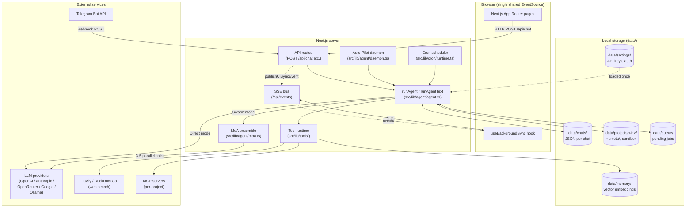
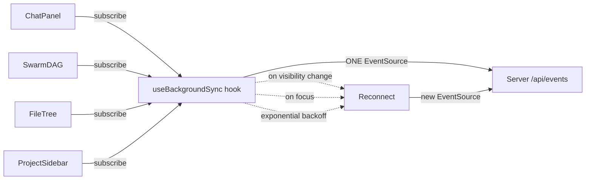

# Orchestra — Architecture & Design

A guided tour of what Orchestra is, why it exists, how it's wired together, and what it intentionally is NOT. Reading time: ~15 minutes.

This document assumes no prior context. The first three sections (What is this / Why it exists / Capabilities) target a curious visitor — recruiter, potential user, or someone deciding whether to fork. The remaining sections target contributors who want to understand the internals before changing them.

---

## 1. What is Orchestra

**Orchestra is a self-hosted AI agent workspace.** You run it on your own laptop (or a small VPS), point it at one or more LLM provider API keys (OpenAI, OpenRouter, Anthropic, Google, Ollama for fully-local), and it gives you a chat-style interface backed by a team of cooperating agents instead of a single model.

Think of it as a hybrid between:

- **Cursor / Claude Desktop / ChatGPT Plus** — a chat UI for an LLM with code execution and tool calling, but…
- **Auto-GPT / CrewAI / LangGraph** — multiple specialized agents debating and verifying each other's work, except orchestrated through a single conversational interface, not a Python notebook.

Everything runs locally. The "database" is plain JSON files on disk under `data/`. The realtime layer is Server-Sent Events — no Redis, no Postgres, no message broker. You own your data; you can `tar -czf` your `data/` directory and your entire project history is portable.

---

## 2. Why Orchestra exists

I built this to explore two specific design questions:

**(1) Can Mixture-of-Agents (MoA) be made *dynamic*?** The standard MoA paper assumes fixed roles (e.g., "coder", "reviewer", "researcher"). Orchestra's Router instead reads the user's exact prompt and *generates* 3–5 hyper-specialized personas on the fly: for a SQL query optimization question you might get "Query Plan Analyst", "Index Strategy Auditor", "Constraint Validator". One slot is *always* allocated to a "Skeptic / QA" persona that fact-checks the others in parallel.

**(2) What does "local-first" actually mean for an AI workspace?** Most "self-hosted ChatGPT" projects still depend on cloud databases, vector services, and external auth providers. Orchestra is a forcing function: JSON-on-disk, file-based message bus (SSE), and `safeWriteFile` + `withFileLock` for concurrency. The constraint surfaces interesting trade-offs (see § "Tradeoffs" below).

It is a personal exploration, not a production product. The [`POST_MORTEMS.md`](../POST_MORTEMS.md) registry — **forty entries and counting** — documents every architectural mistake found along the way and how the regression is now pinned. The honesty is the point.

### Origins

Orchestra is a hard-fork of [Eggent](https://github.com/eggent-ai/eggent). The Eggent codebase was imported as the starting point, then extended on top of it: a data-isolation layer (`ORCHESTRA_DATA_DIR`), chat soft-delete + index-integrity recovery, observability/post-mortem tooling, an expanded test suite, a Russian/English bilingual surface, project sandbox export, the multi-provider key waterfall, and numerous fixes (~30k net lines added across 100+ new files). The **foundational architecture — the Mixture-of-Agents pipeline, the JSON-on-disk storage model, and the agent/tooling layout — originates from Eggent**, and the majority of the imported source files remain substantially intact. The upstream's MIT license is preserved; see [`NOTICE.md`](../NOTICE.md) for full attribution.

---

## 3. Core capabilities (at a glance)

| Feature | What it does | Why it's interesting |
|---|---|---|
| **Mixture-of-Agents** | Routes each user message through 3–5 dynamically-generated expert personas in parallel, then aggregates. Skeptic is *enforced by code*, not just by prompt. Embedding-based disagreement detection asks the synthesizer to surface conflicts instead of smoothing them. Optional reflection critic + revisor adds a generator-critic-revisor loop. Aggregator prompt is adapted from togethercomputer/MoA (validated at 65.1% AlpacaEval). | Higher answer quality than single-model output, especially for ambiguous prompts. Latency cost is parallel, not serial. Cost is visible per-chat via PM #36 banner. |
| **Project Workspaces** | Isolated sandboxes with per-project memory, skills, MCP servers, and file tree. | The agent can read/write files in its own working directory without leaking state across projects. |
| **Skills System** | Installable capability modules (~30 bundled, more via GitHub). Each skill is a Markdown SKILL.md + supporting scripts. | Skills are model-portable — they describe *intent* and *triggers*, not provider-specific tool calls. |
| **Project ZIP Export** | One-click download of an entire project (code + chats + metadata) as a single ZIP archive. | Treat Orchestra projects like git repos — portable, shareable, backupable. |
| **Memory (RAG)** | Vector embeddings over uploaded knowledge files (PDF, DOCX, XLSX, Markdown, images). Per-project blackboard for cross-agent fact sharing. | The agent can recall facts you taught it weeks ago without re-uploading. |
| **Cron Scheduler** | Schedule agent turns to fire on intervals, cron expressions, or absolute timestamps. Routes results back via Telegram or chat. | The agent works for you when you're not at the keyboard. |
| **Background Auto-Pilot** | Daemon mode: the agent iterates autonomously on a goal tree, hard-capped at 50 iterations to bound API spend. | Long-running tasks (e.g., "review this codebase for security issues") run without a human in the loop. |
| **Telegram Gateway** | Full bot mode — agent receives/sends Telegram messages, supports access-codes, group chats, voice notes. | Conversational interface from anywhere, not just the web UI. |
| **MCP (Model Context Protocol)** | Per-project MCP server config — connect Orchestra to any MCP-compatible tool source. | Future-proof tool surface; works with anything Anthropic-spec-compliant. |

---

## 4. High-level architecture



**Reading the diagram top-to-bottom**: the user sends a message through the browser UI → it hits a Next.js API route → which calls `runAgent` → which (if Swarm mode is on) dispatches MoA → which calls 3–5 LLM providers in parallel → the results are aggregated → tools may be invoked along the way → progress events are pushed back to the browser via SSE → the final response is persisted to disk and streamed back.

---

## 5. Request lifecycle — what happens when you press Enter

```mermaid
sequenceDiagram
    actor User
    participant UI as Browser
    participant API as POST /api/chat
    participant RA as runAgent
    participant Router as MoA Router
    participant P as Proposer (×N)
    participant Agg as Aggregator
    participant SSE as SSE bus
    participant Disk as data/chats/&lt;id&gt;.json

    User->>UI: types message + Enter
    UI->>API: POST /api/chat {chatId, message}
    API->>RA: runAgent({chatId, abortSignal: req.signal})
    Note over RA: PM #1 — req.signal is mandatory<br/>so closing the tab kills the stream

    alt Swarm mode ON
        RA->>Router: classify intent + design personas
        Router-->>RA: [Analyst, Strategist, Implementer, ...]
        Note over RA: PM #37 — post-validate: inject<br/>canonical Skeptic if LLM forgot
        par Parallel proposers (Promise.all + stagger + per-call timeout)
            RA->>P: persona 1 prompt
            RA->>P: persona 2 prompt
            RA->>P: persona 3 prompt
            RA->>P: Skeptic (force-injected if missing)
        end
        P-->>RA: draft 1 + usage
        P-->>RA: draft 2 + usage
        P-->>RA: draft 3 + usage
        P-->>RA: skeptic critique + usage
        Note over RA: PM #39 — embed drafts,<br/>compute pairwise cosine distance.<br/>If max > 0.35, prepend<br/><<DISAGREEMENT_DETECTED>><br/>marker to aggregator prompt
        Note over RA,Agg: PM #2 — aggregator NEVER receives<br/>consecutive user messages<br/>PM #40 — system prompt adapted<br/>from togethercomputer/MoA
        RA->>Agg: aggregator prompt + drafts (NO chat history)
        Agg-->>RA: synthesized answer + usage

        opt Reflection enabled (PM #38)
            RA->>Agg: critic prompt (utility-model)
            Agg-->>RA: {shouldRevise, critique, suggestion}
            alt critic flags issue
                RA->>Agg: revisor prompt (brain-model)
                Agg-->>RA: revised answer + usage
            end
        end
    else Direct mode
        RA->>P: single LLM call with full chat history
        P-->>RA: streamed response
    end
    Note over RA: PM #36 — fold every call's usage<br/>into chat.cumulativeUsage<br/>(tokens + USD for the banner)

    loop For each chunk
        RA->>SSE: stream chunk event
        SSE-->>UI: chunk delivered to subscribers
        UI->>User: token appears in UI
    end

    RA->>Disk: persist full assistant message
    RA->>SSE: publishUiSyncEvent({reason: "message_complete"})
    SSE-->>UI: synthetic resync trigger
    UI->>Disk: GET /api/chat/history (reconciliation)
    Note over UI,Disk: PM #5 — disk JSON is the source of truth<br/>SSE is fire-and-forget; reconciliation closes any gap
```

The two critical invariants in this flow are pinned by [`POST_MORTEMS.md`](../POST_MORTEMS.md) entries:

- **PM #1** (`AbortSignal` propagation) — every long-running operation along this path receives `req.signal`. When the user closes the tab, the LLM stream is killed within milliseconds. Before the fix, zombie streams would accumulate and pin the V8 GC at 100% CPU within days.
- **PM #5** (SSE reconciliation) — SSE has no replay buffer, so any event lost during a network blink is gone forever. The fix is fire-and-forget on the wire, but with `data/chats/<id>.json` as the canonical source. After every transient SSE event, a synthetic resync triggers the UI to refetch from disk.

---

## 6. Storage layout

There is no traditional database. The `data/` directory **is** the database.

```
data/
├── chat-index.json           ← lightweight index for the sidebar
├── chats/
│   └── <chatId>.json         ← full message history per chat
├── projects/
│   └── <projectId>/
│       ├── .meta/
│       │   ├── project.json  ← name, description, instructions
│       │   ├── skills/       ← installed Agent Skills
│       │   ├── mcp/          ← MCP server configs
│       │   ├── knowledge/    ← uploaded RAG sources
│       │   └── cron/         ← scheduled jobs
│       └── <user-files>      ← the agent's working directory
│                                (Python, Node, whatever the agent writes)
├── memory/
│   └── <subdir>/embeddings.json  ← vector embeddings
├── settings/
│   └── settings.json         ← global config, API keys, auth hash
├── queue/                    ← pending background jobs
├── external-sessions/        ← OAuth/integration session blobs
├── logs/                     ← (optional) ORCHESTRA_LOG_TO_FILE=1
└── tmp/                      ← ephemeral, safe to wipe
```

**Concurrency safety:** Every read-modify-write to a JSON file goes through [`withFileLock`](../src/lib/storage/fs-utils.ts) (in-process Map-keyed mutex) and writes through [`safeWriteFile`](../src/lib/storage/fs-utils.ts) (tmp-then-rename atomic write). **Single-process invariant** — this scheme provides no cross-process safety; deploying Orchestra in cluster mode (PM2 `instances: > 1`) is **not supported**. See `CLAUDE.md` §"Critical Rules" for the upgrade path if you need it.

**Project portability:** the `data/projects/<id>/` subtree is fully self-contained. `GET /api/projects/<id>/export` streams it as a ZIP including matching chats and a manifest. This is intentional: you can fork-and-share an entire project state.

---

## 7. Frontend resilience

The browser maintains a **single shared `EventSource`** (`useBackgroundSync` hook) — not one per component. Components subscribe to topics; the hook fans them out. This matters because browsers cap at 6 HTTP/1.1 connections per origin — one renegade component instantiating its own EventSource would starve the rest of the page.



When the browser tab goes hidden → visible, or `window.focus` fires, the hook proactively triggers a synthetic resync event so all subscribers refetch from disk. This is the PM #5 fix in shape: SSE is the **trigger**, disk JSON is the **truth**.

---

## 8. Security model

**Designed for a single trusted operator.** Orchestra running on your laptop is for you. Orchestra running on a VPS is for you and the few people you trust with shell access. It is *not* a multi-tenant SaaS.

What that means concretely:

| Concern | How it's handled |
|---|---|
| Authentication | scrypt-hashed password in `data/settings/settings.json`. Session cookie signed with HMAC-SHA256 over `ORCHESTRA_AUTH_SECRET`. Refuses to start in production without a real secret (PM #12). |
| Path traversal | Every API route that takes a user-supplied filename runs it through `assertPathInside` + a strict basename sanitizer. Audited routes are listed in `CLAUDE.md` §"Security Patterns". Pre-fix bugs caught by [PM #6](../POST_MORTEMS.md), [PM #16](../POST_MORTEMS.md), [PM #21](../POST_MORTEMS.md). |
| SSRF | Server-side `fetch` to user-supplied URLs goes through `assertSafeOutboundUrl`. Rejects private/link-local/cloud-metadata addresses (169.254.169.254 etc.). PM #8. |
| Secret leakage on SSR | `RootLayout` never reads files that contain auth secrets — UI preferences (theme, locale) load via inline `<script>` from `localStorage`. PM #15. |
| Code execution | The agent's `code_execution` tool runs in `child_process.spawn` with `cwd` pinned to the project sandbox. In Docker, the `node` user has passwordless sudo to allow apt installs — this is a deliberate trade-off for OOTB experience. |
| API keys | Stored in `data/settings/settings.json` (gitignored) or `.env.local` (gitignored). The `npm run scrub:secrets` script migrates any plaintext keys out of settings.json before sharing. |

---

## 9. Code map — where things live

```
src/
├── app/                         Next.js App Router
│   ├── api/
│   │   ├── chat/                main agent entry (POST /api/chat)
│   │   ├── events/              SSE bus
│   │   ├── projects/[id]/       project CRUD + export ZIP
│   │   ├── auth/                login, logout, credentials
│   │   ├── integrations/        Telegram gateway
│   │   └── ...
│   ├── dashboard/               the UI (projects, settings, skills, cron, memory)
│   └── login/
├── components/                  React UI
│   ├── chat/                    chat-panel, swarm-dag, message-bubble
│   └── ui/                      Radix + shadcn primitives
├── lib/
│   ├── agent/                   ★ runAgent, MoA, daemon, ghost-sweeper
│   ├── memory/                  vector DB, embeddings, RAG loaders
│   ├── storage/                 JSON filesystem adapters
│   ├── tools/                   code execution, web search, MCP
│   ├── realtime/                event bus
│   ├── cron/                    scheduler runtime + service
│   ├── auth/                    password hashing, session tokens
│   ├── security/                URL guard, path guard
│   └── observability/           structured logger, replay, postmortem
└── prompts/                     system.md + per-tool prompt fragments
```

The hottest files for understanding the agent:

1. [`src/lib/agent/agent.ts`](../src/lib/agent/agent.ts) — `runAgent` / `runAgentText`. ~1700 lines. The orchestrator.
2. [`src/lib/agent/moa.ts`](../src/lib/agent/moa.ts) — Mixture-of-Agents ensemble.
3. [`src/lib/tools/tool.ts`](../src/lib/tools/tool.ts) — `ToolSet` construction and per-tool dispatch.
4. [`src/lib/storage/project-store.ts`](../src/lib/storage/project-store.ts) — project CRUD, GitHub skill import, MCP config.
5. [`docs/request-flow.md`](./request-flow.md) — fuller text walkthrough of § 5 above.

---

## 10. Tradeoffs (a.k.a. what Orchestra is NOT)

Honest list. If any of these are dealbreakers for your use case, fork something else (or fork Orchestra and rewrite the offending layer).

- **Not a SaaS.** Single-tenant by design. No row-level isolation, no tenant boundaries in the storage layer. If you put it on a public VPS without a firewall, anyone who can reach port 3000 + guesses your password owns the box.
- **Not horizontally scalable.** The `withFileLock` mutex is in-process. Cluster mode = silent data corruption. The "fix" if you ever need scale is replacing the lock with an advisory lockfile or moving storage to SQLite-WAL or Postgres.
- **Not real-time-collaborative.** No CRDTs, no Y.js, no Liveblocks. One operator at a time, even if multiple browser tabs are open.
- **Latency is bounded by your LLM provider.** A single MoA turn dispatches 3–5 LLM calls in parallel; total wall-clock is `max(provider_latencies) + aggregation_latency`. Typically 5–15 seconds end-to-end for substantive prompts.
- **`agent.ts` test coverage is partial.** ~6% line coverage on the main agent file. The architecture is verified end-to-end manually; the surrounding modules (security, storage, memory, cron, auth, MoA) are well-covered (often 90%+). See `vitest.config.ts` coverage thresholds for the floor each module commits to.
- **Some bundled-skills are proprietary.** `bundled-skills/docx/`, `bundled-skills/xlsx/`, `bundled-skills/coding-agent/` retain their original licenses (Anthropic, all rights reserved). See [`NOTICE.md`](../NOTICE.md) — the top-level MIT does NOT cover those subdirectories. If you fork commercially, remove them.

---

## 11. Going deeper

Documents and code paths to read next, in roughly increasing depth:

1. [`README.md`](../README.md) — quick-start.
2. [`docs/request-flow.md`](./request-flow.md) — narrative walkthrough of § 5 with file-by-file pointers.
3. [`POST_MORTEMS.md`](../POST_MORTEMS.md) — every architectural bug found in development. Reads as a design retrospective.
4. [`CLAUDE.md`](../CLAUDE.md) — AI-assistant-facing rules. Doubles as an architectural-decision register: every "Critical Rule" maps to a real incident.
5. [`docs/observability.md`](./observability.md) — logging, tracing, on-disk audit trail.
6. The hot files in § 9 above, in order.

---

*Last reviewed: 2026-05-18. Diagrams use Mermaid syntax and render directly on GitHub.*
